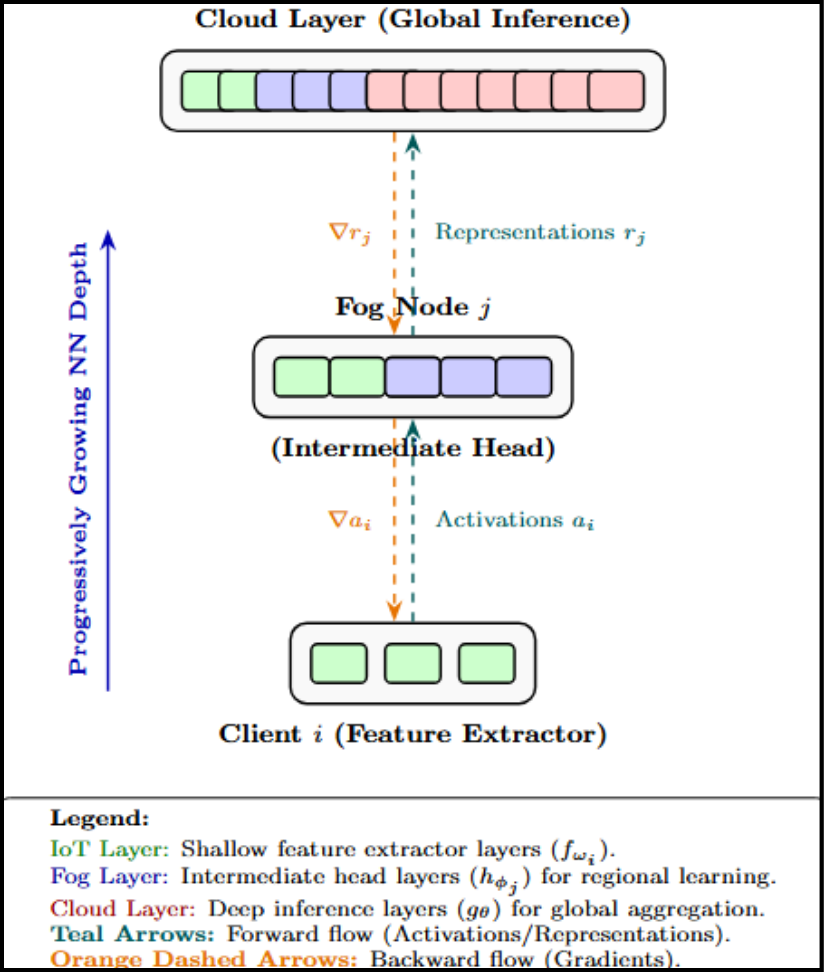
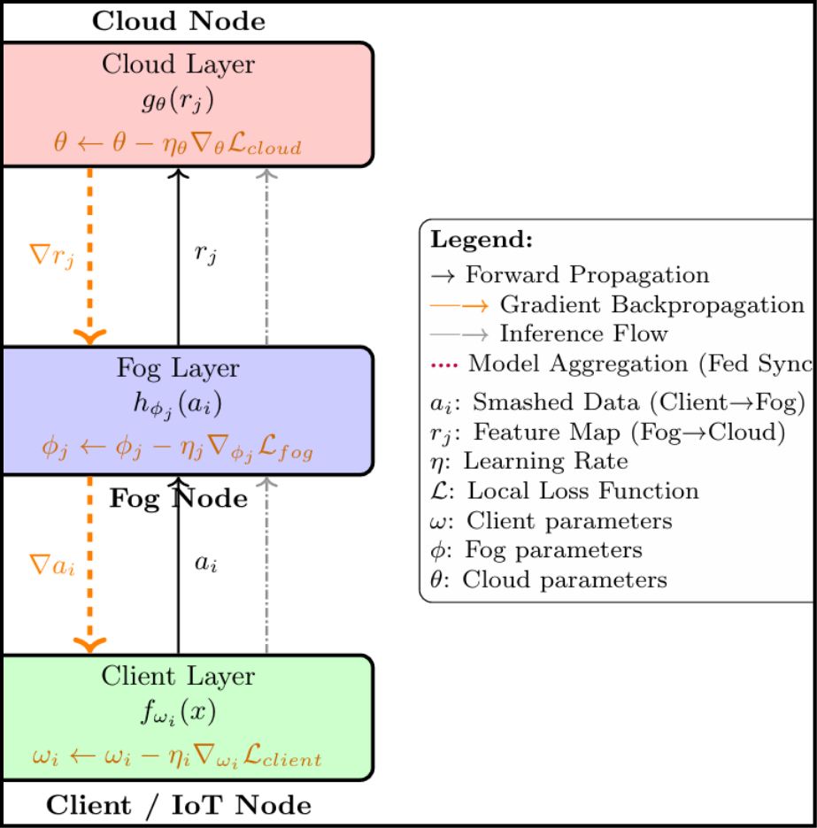
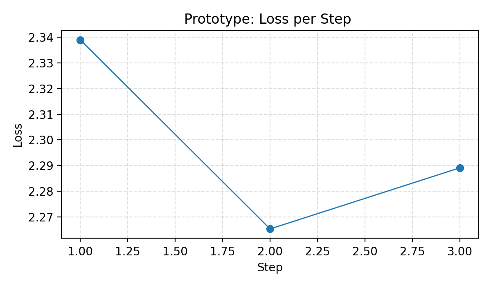
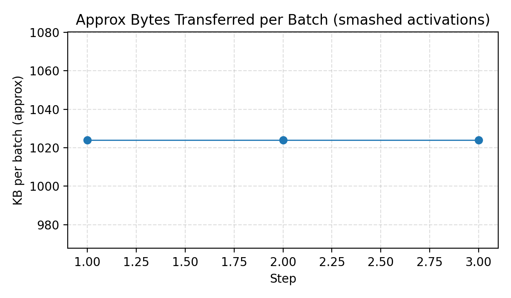

# Federated Learning in IoT–Fog–Cloud Hierarchies Using Progressively Deepening Split Neural Networks

**Status:** Architecture-Driven Reference Implementation (End-to-End Simulation)

---

## Submitted by

- **Pranav Gupta** (22JE0710)  
- **Saransh Shivhare** (22JE0867)  
- **Ayush Shaw** (22JE0221)  

**Under the guidance of:**  
**Prof. Prasanta K. Jana**  
Department of Computer Science and Engineering  
Indian Institute of Technology (ISM) Dhanbad

---

## Overview

This repository contains a reproducible **research prototype** for **Progressive Split-Federated Learning (HSFL)** across an **IoT–Fog–Cloud** hierarchy.

The goal is to provide:
- A clear system architecture
- A reference implementation (prototype)
- A small-scale simulation validating **dataflow** and **communication overhead**

> ⚠️ This is a **research repository**, not a production deployment.  
> It is designed for reproducibility, experimentation, and extension.

---

## System Architecture

### Overall IoT–Fog–Cloud Hierarchy



### Training & Communication Workflow



---

### Key Highlights

- **Architecture-first design:** Explicit separation of IoT, Fog, and Cloud layers
- **Reproducible prototype:** Run locally using CIFAR-10 or random tensors
- **Experiment artifacts:** Logs and plots generated automatically
- **Honest scope:** Pipeline validation, not full-scale convergence

---

## Development & Setup

Tested on Windows (PowerShell) and Linux/macOS with Python 3.10+.

### 1. Clone the repository
```bash
git clone https://github.com/saranshs17/hybrid-SplitNN-FL.git
cd hybrid-SplitNN-FL
```

### 2. Create & activate a virtual environment

**Windows (PowerShell)**
```powershell
python -m venv .venv
.\.venv\Scripts\Activate.ps1
```

**Linux / macOS**
```bash
python3 -m venv .venv
source .venv/bin/activate
```

### 3. Install dependencies
```bash
python -m pip install --upgrade pip
pip install -r requirements.txt
```

`requirements.txt` includes PyTorch, matplotlib, pytest, PyYAML, and torchvision.

### 4. Run the prototype simulation
```bash
python -m src.sim.run_simulation --config configs/experiment.yaml
```

- If `dataset: cifar10` → CIFAR-10 will be downloaded (requires torchvision)
- For fast offline runs, set `dataset: random`

**Outputs (saved to `results/`):**

- `results/log.txt`
- `results/loss_curve.png`
- `results/bytes_per_batch.png`

### 5. Run unit tests
```bash
pytest -q
```

Run a specific test:
```bash
pytest tests/test_protocol.py::test_run_round_smoke -q -s
```

---

## Prototype Experiment Results (Example)

The following results are from a CIFAR-10 experiment (one batch per epoch) to validate architectural correctness.

**Loss per step**



**Approximate communication per batch**



> Loss fluctuations are expected due to the small dataset subset and limited steps.

---

## High-Level Workflow

### IoT Clients
- Perform lightweight feature extraction
- Generate smashed activations

### Fog Nodes
- Receive activations
- Perform regional feature computation

### Cloud Server
- Final inference and parameter updates
- Full cross-device SplitNN backpropagation is planned as future work

---

## Reference Documents

- **`docs/Project_Report.pdf`** — thesis (architecture & analysis)
- **`docs/Architecture_Slides.pdf`** — Presentation slides

---

## Future Extensions

- Implement full SplitNN backpropagation
- Add secure aggregation & compression
- Scale experiments using Flower / FedML
- Multi-host IoT–Fog–Cloud deployment

---

## License

This project is licensed under the MIT License.  
See the [LICENSE](LICENSE) file for details.

---

## Contact

**Saransh Shivhare**  
saranshmain17@gmail.com  
